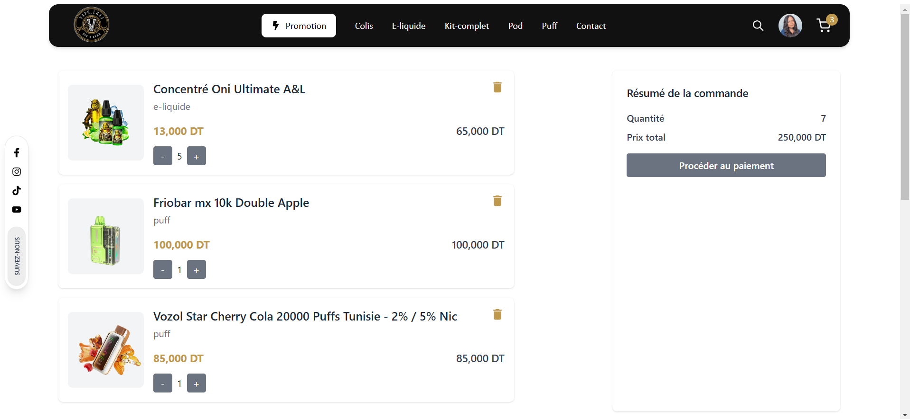
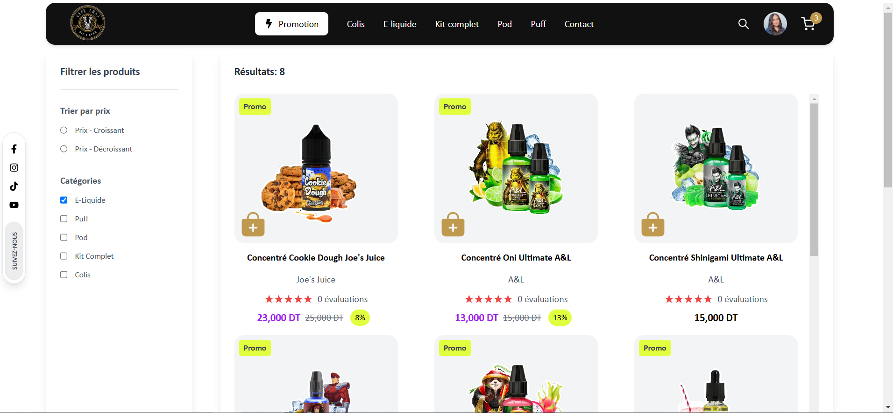
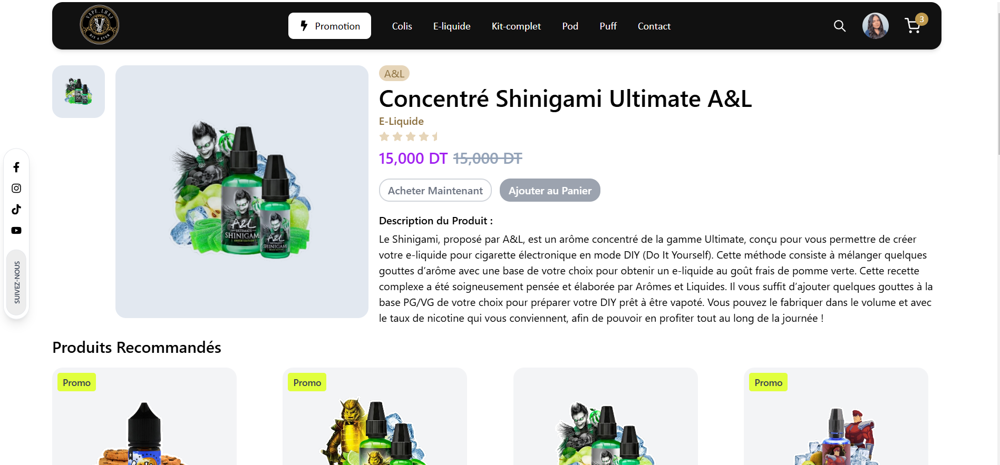
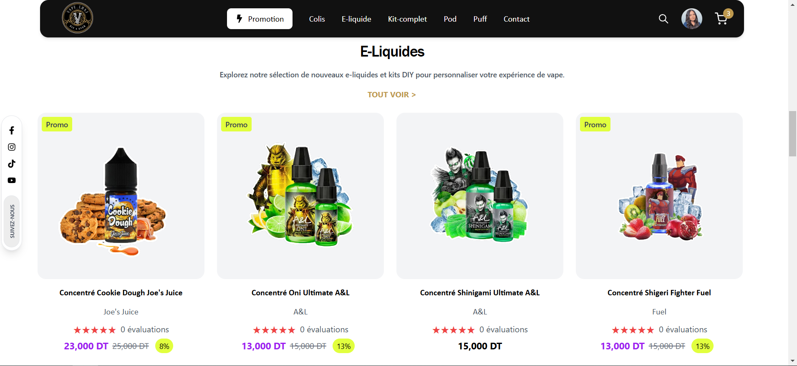

# Full-Stack E-Commerce MERN App







[Watch Demo on YouTube](https://www.youtube.com/watch?v=9yBf5LDiSpw&t=7s&ab_channel=emnaothmen)


## Description

This project is a full-stack e-commerce platform built for a vape store. The platform enables customers to browse, search, and purchase products seamlessly, with key features such as product filtering, add-to-cart functionality, and secure checkout using Stripe integration. It also includes image zoom for product detail views and complete CRUD operations for product management. Admins and users have role-based access, while JWT token authentication ensures secure access.

## Key Features

- **Product Filtering and Search**: Allows customers to filter and search products efficiently.
- **Add-to-Cart**: Customers can easily add items to their cart and view cart details.
- **Secure Checkout with Stripe Integration**: Supports secure payment handling via Stripe.
- **Image Zoom**: Enhances the shopping experience with zoom functionality for product images.
- **CRUD Operations for Product Management**: Full management capabilities for adding, editing, and deleting products.
- **Role-Based Access**: Admins have full access to manage products and view orders, while users can browse and purchase items.
- **JWT Token Authentication**: Secures the platform with token-based user authentication.
- **Modern UI with Tailwind CSS**: Clean and intuitive interface for a smooth shopping experience.

## Tech Stack

- **Frontend**: React, Tailwind CSS
- **Backend**: Express.js, MongoDB
- **Payment Integration**: Stripe
- **Authentication**: JWT Token Authentication

## Installation

### Prerequisites

Make sure you have [Node.js](https://nodejs.org/), [MongoDB](https://www.mongodb.com/), and a [Stripe](https://stripe.com/) account and API keys.

### Clone the Repository

```bash
git clone https://github.com/yourusername/Full-Stack-E-Commerce-MERN-APP.git
cd Full-Stack-E-Commerce-MERN-APP
```

### Backend Setup

1. Navigate to the backend directory:
    ```bash
    cd backend
    ```

2. Install backend dependencies:
    ```bash
    npm install
    ```

3. Create a `.env` file in the backend directory and add your MongoDB URI, Token Secret Key, and frontend URL:

    ```plaintext
    MONGODB_URI=your_mongodb_uri
    TOKEN_SECRET_KEY=your_secret_key
    FRONTEND_URL=http://localhost:3000
    ```

4. Start the backend server:
    ```bash
    npm run dev
    ```

### Frontend Setup

1. Navigate to the frontend directory:
    ```bash
    cd frontend
    ```

2. Install frontend dependencies:
    ```bash
    npm install
    ```

3. Create a `.env` file in the frontend directory and add your Cloudinary Cloud Name if using Cloudinary for image hosting:

    ```plaintext
    REACT_APP_CLOUD_NAME_CLOUDINARY=your_cloud_name
    ```

4. Start the frontend server:
    ```bash
    npm start
    ```

### Stripe Setup

To enable Stripe payments, you’ll need to add your Stripe API keys in the backend (ensure secure handling of these credentials).

## Environment Variables

### Backend `.env`

- `MONGODB_URI`: Your MongoDB connection URI.
- `TOKEN_SECRET_KEY`: Secret key for JWT authentication.
- `FRONTEND_URL`: URL of the frontend application.

### Frontend `.env`

- `REACT_APP_CLOUD_NAME_CLOUDINARY`: Cloudinary cloud name if using Cloudinary for images.

## License

This project is licensed under the MIT License.
